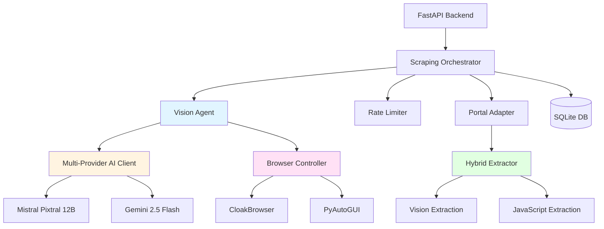
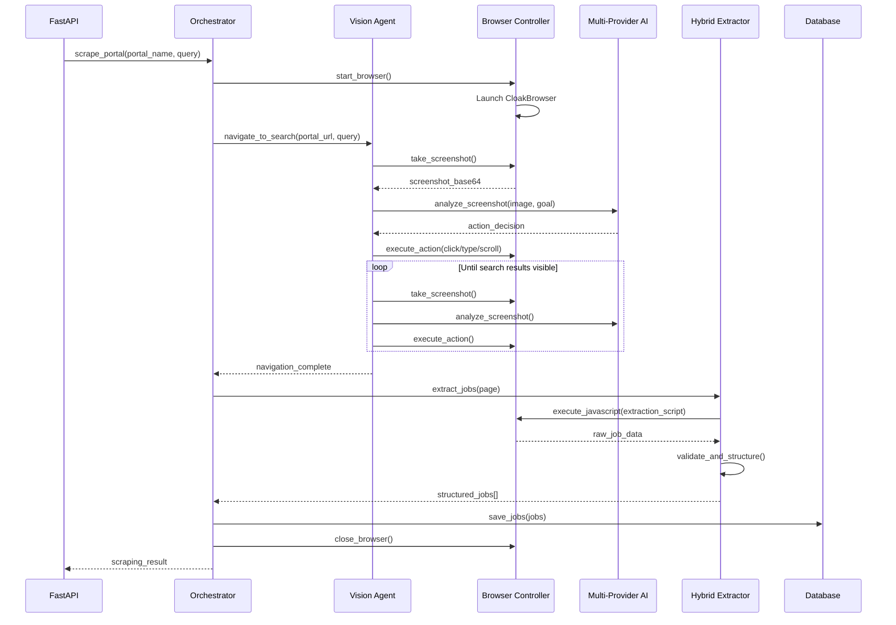
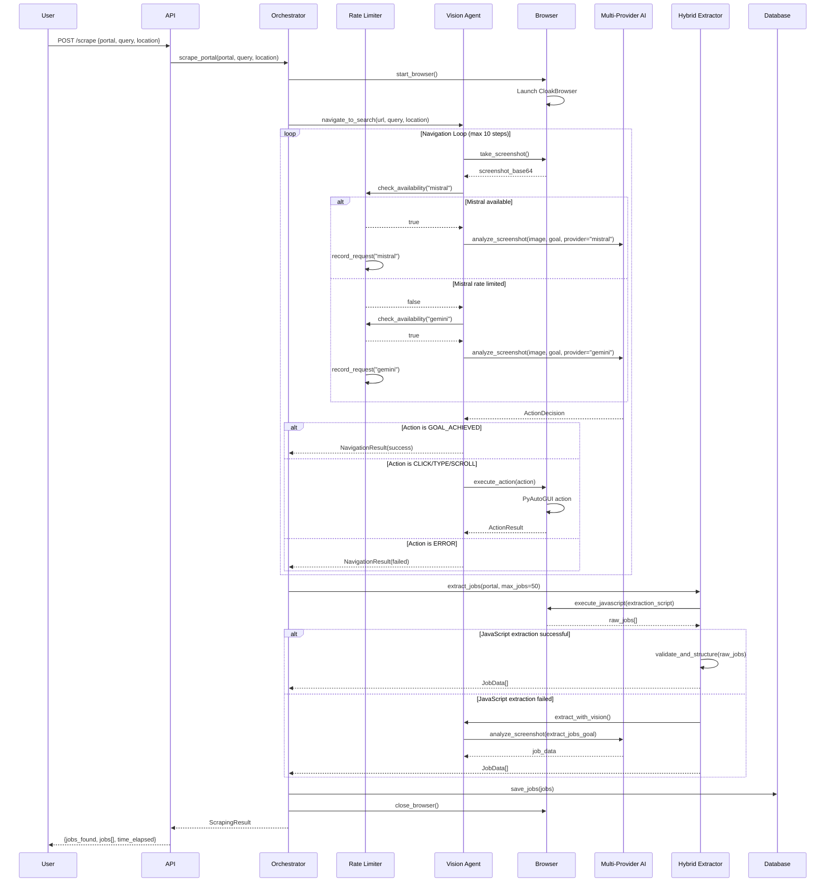

# Design Document: Vision-Guided Adaptive Scraping

## Overview

Transform the job scraping system from brittle hardcoded CSS selectors to adaptive vision-guided navigation. The system uses Mistral Pixtral 12B (vision model) to analyze screenshots and decide actions, executes via PyAutoGUI + CloakBrowser, and self-heals when portals update. This eliminates monthly selector maintenance while providing universal portal support with the same codebase.

The hybrid approach uses vision for navigation (adaptive) and JavaScript for extraction (fast, structured), combining the best of both worlds. The system handles popups, cookie banners, and sign-in prompts automatically, working across all 8 job portals (Naukri, Indeed, LinkedIn, TimesJobs, Shine, Foundit, CutShort, Glassdoor) with zero portal-specific logic.

## Architecture

### System Context



### Component Interaction Flow




## Components and Interfaces

### Component 1: Vision Agent

**Purpose**: Analyzes screenshots and decides navigation actions using vision models

**Interface**:
```python
class VisionAgent:
    def __init__(self, ai_client: MultiProviderAIClient, browser: BrowserController):
        pass
    
    async def navigate_to_search(
        self, 
        portal_url: str, 
        search_query: str, 
        location: str
    ) -> NavigationResult:
        """Navigate to search results using vision-guided actions"""
        pass
    
    async def handle_popup(self) -> bool:
        """Detect and dismiss popups/cookie banners"""
        pass
    
    async def analyze_screenshot(
        self, 
        screenshot: str, 
        goal: str
    ) -> ActionDecision:
        """Analyze screenshot and decide next action"""
        pass
    
    async def execute_action(self, action: ActionDecision) -> ActionResult:
        """Execute decided action via browser controller"""
        pass
```

**Responsibilities**:
- Take screenshots at each navigation step
- Send screenshots to vision model with goal context
- Parse vision model responses into structured actions
- Execute actions via browser controller
- Handle errors and retry logic
- Detect when goal is achieved (search results visible)


### Component 2: Browser Controller (Enhanced)

**Purpose**: Controls CloakBrowser and executes actions via PyAutoGUI

**Interface**:
```python
class BrowserController:
    async def start(self) -> None:
        """Launch CloakBrowser with stealth settings"""
        pass
    
    async def take_screenshot(self, full_page: bool = False) -> str:
        """Capture screenshot and return base64 encoded"""
        pass
    
    async def click_at_coordinates(self, x: int, y: int) -> ActionResult:
        """Click at specific screen coordinates using PyAutoGUI"""
        pass
    
    async def type_text_at_coordinates(
        self, 
        x: int, 
        y: int, 
        text: str
    ) -> ActionResult:
        """Click coordinates then type text"""
        pass
    
    async def scroll_page(self, direction: str, amount: int) -> ActionResult:
        """Scroll page in specified direction"""
        pass
    
    async def execute_javascript(self, script: str) -> Any:
        """Execute JavaScript in page context"""
        pass
    
    async def get_page_state(self) -> PageState:
        """Get current page URL, title, and load state"""
        pass
    
    async def close(self) -> None:
        """Close browser and cleanup"""
        pass
```

**Responsibilities**:
- Manage CloakBrowser lifecycle
- Capture screenshots for vision analysis
- Execute coordinate-based actions via PyAutoGUI
- Execute JavaScript for fast extraction
- Track page state and navigation
- Handle browser errors and crashes


### Component 3: Hybrid Extractor

**Purpose**: Extract job data using vision navigation + JavaScript extraction

**Interface**:
```python
class HybridExtractor:
    def __init__(self, vision_agent: VisionAgent, browser: BrowserController):
        pass
    
    async def extract_jobs(
        self, 
        portal_name: str, 
        max_jobs: int = 50
    ) -> List[JobData]:
        """Extract jobs using hybrid approach"""
        pass
    
    async def extract_with_javascript(self) -> List[Dict[str, Any]]:
        """Fast extraction using JavaScript selectors"""
        pass
    
    async def extract_with_vision(self) -> List[Dict[str, Any]]:
        """Fallback extraction using vision model"""
        pass
    
    async def validate_job_data(self, job: Dict[str, Any]) -> bool:
        """Validate extracted job has required fields"""
        pass
    
    async def scroll_and_extract(self, max_jobs: int) -> List[JobData]:
        """Scroll through results and extract incrementally"""
        pass
```

**Responsibilities**:
- Try JavaScript extraction first (fast)
- Fall back to vision extraction if JS fails
- Scroll through paginated results
- Validate extracted data quality
- Deduplicate jobs by URL
- Structure data into JobData model


### Component 4: Rate Limiter

**Purpose**: Manage API rate limits across Mistral and Gemini providers

**Interface**:
```python
class RateLimiter:
    def __init__(self):
        self.mistral_limit = {"rpm": 2, "requests": [], "last_reset": time.time()}
        self.gemini_limit = {"rpm": 15, "requests": [], "last_reset": time.time()}
    
    async def check_availability(self, provider: str) -> bool:
        """Check if provider has capacity"""
        pass
    
    async def wait_for_capacity(self, provider: str) -> None:
        """Wait until provider has capacity"""
        pass
    
    async def record_request(self, provider: str) -> None:
        """Record that a request was made"""
        pass
    
    def get_next_available_provider(self) -> str:
        """Get provider with available capacity"""
        pass
    
    def get_rate_limit_status(self) -> Dict[str, Any]:
        """Get current rate limit status for all providers"""
        pass
```

**Responsibilities**:
- Track requests per minute for each provider
- Enforce rate limits (Mistral: 2 RPM, Gemini: 15 RPM)
- Provide wait times when rate limited
- Rotate between providers intelligently
- Reset counters every minute
- Provide status visibility


### Component 5: Portal Adapter

**Purpose**: Provide universal interface for all job portals

**Interface**:
```python
class PortalAdapter:
    PORTALS = {
        "naukri": {"url": "https://www.naukri.com", "search_path": "/jobs"},
        "indeed": {"url": "https://www.indeed.com", "search_path": "/jobs"},
        "linkedin": {"url": "https://www.linkedin.com", "search_path": "/jobs/search"},
        "timesjobs": {"url": "https://www.timesjobs.com", "search_path": "/candidate/job-search.html"},
        "shine": {"url": "https://www.shine.com", "search_path": "/job-search"},
        "foundit": {"url": "https://www.foundit.in", "search_path": "/srp/results"},
        "cutshort": {"url": "https://cutshort.io", "search_path": "/jobs"},
        "glassdoor": {"url": "https://www.glassdoor.com", "search_path": "/Job/jobs.htm"}
    }
    
    def get_portal_url(self, portal_name: str) -> str:
        """Get base URL for portal"""
        pass
    
    def build_search_url(
        self, 
        portal_name: str, 
        query: str, 
        location: str
    ) -> str:
        """Build search URL with query parameters"""
        pass
    
    def get_portal_config(self, portal_name: str) -> Dict[str, Any]:
        """Get portal-specific configuration"""
        pass
    
    def list_supported_portals(self) -> List[str]:
        """List all supported portal names"""
        pass
```

**Responsibilities**:
- Maintain portal metadata (URLs, search paths)
- Build search URLs with proper query encoding
- Provide portal-agnostic interface
- Support easy addition of new portals
- No portal-specific scraping logic


### Component 6: Scraping Orchestrator

**Purpose**: Coordinate the complete scraping workflow

**Interface**:
```python
class ScrapingOrchestrator:
    def __init__(
        self,
        vision_agent: VisionAgent,
        hybrid_extractor: HybridExtractor,
        rate_limiter: RateLimiter,
        portal_adapter: PortalAdapter
    ):
        pass
    
    async def scrape_portal(
        self,
        portal_name: str,
        query: str,
        location: str,
        max_jobs: int = 50
    ) -> ScrapingResult:
        """Execute complete scraping workflow for one portal"""
        pass
    
    async def scrape_all_portals(
        self,
        query: str,
        location: str,
        max_jobs_per_portal: int = 50
    ) -> Dict[str, ScrapingResult]:
        """Scrape all portals sequentially"""
        pass
    
    async def handle_scraping_error(
        self,
        portal_name: str,
        error: Exception
    ) -> ErrorRecoveryResult:
        """Handle errors with retry logic"""
        pass
```

**Responsibilities**:
- Coordinate vision agent, extractor, and rate limiter
- Execute complete scraping workflow
- Handle errors and retries
- Track scraping progress
- Save results to database
- Provide status updates


## Data Models

### ActionDecision

```python
from enum import Enum
from typing import Optional, Dict, Any
from pydantic import BaseModel

class ActionType(Enum):
    CLICK = "click"
    TYPE = "type"
    SCROLL = "scroll"
    WAIT = "wait"
    GOAL_ACHIEVED = "goal_achieved"
    ERROR = "error"

class ActionDecision(BaseModel):
    action_type: ActionType
    coordinates: Optional[tuple[int, int]] = None  # For click/type
    text: Optional[str] = None  # For type action
    direction: Optional[str] = None  # For scroll: "down", "up"
    amount: Optional[int] = None  # For scroll: pixels
    wait_seconds: Optional[int] = None  # For wait
    reasoning: str  # Why this action was chosen
    confidence: float  # 0.0 to 1.0
    metadata: Dict[str, Any] = {}
```

**Validation Rules**:
- action_type must be valid ActionType enum
- coordinates required for CLICK and TYPE actions
- text required for TYPE action
- direction and amount required for SCROLL action
- confidence must be between 0.0 and 1.0
- reasoning must be non-empty string


### NavigationResult

```python
class NavigationStatus(Enum):
    SUCCESS = "success"
    FAILED = "failed"
    RATE_LIMITED = "rate_limited"
    TIMEOUT = "timeout"

class NavigationResult(BaseModel):
    status: NavigationStatus
    steps_taken: int
    actions_executed: List[ActionDecision]
    final_url: str
    time_elapsed: float  # seconds
    error_message: Optional[str] = None
    screenshots: List[str] = []  # base64 encoded
```

### JobData

```python
class JobData(BaseModel):
    title: str
    company: str
    location: str
    source: str  # portal name
    source_url: str
    apply_url: str
    salary: Optional[str] = None
    experience_required: Optional[str] = None
    skills_required: List[str] = []
    description: Optional[str] = None
    remote: bool = False
    walk_in: bool = False
    internship: bool = False
    posted_date: Optional[str] = None
    extracted_at: str  # ISO timestamp
```

**Validation Rules**:
- title, company, source, source_url, apply_url are required
- source_url and apply_url must be valid URLs
- source must be one of supported portal names
- extracted_at must be ISO 8601 format


### ScrapingResult

```python
class ScrapingResult(BaseModel):
    portal_name: str
    query: str
    location: str
    jobs_found: int
    jobs_extracted: List[JobData]
    navigation_result: NavigationResult
    extraction_method: str  # "javascript" or "vision"
    time_elapsed: float  # seconds
    success: bool
    error_message: Optional[str] = None
    api_calls_made: int
    rate_limit_waits: int
```

### PageState

```python
class PageState(BaseModel):
    url: str
    title: str
    load_state: str  # "loading", "loaded", "error"
    has_popup: bool
    has_search_results: bool
    viewport_width: int
    viewport_height: int
```


## Main Algorithm/Workflow




## Key Functions with Formal Specifications

### Function 1: navigate_to_search()

```python
async def navigate_to_search(
    self,
    portal_url: str,
    search_query: str,
    location: str,
    max_steps: int = 10
) -> NavigationResult
```

**Preconditions:**
- `portal_url` is a valid HTTP/HTTPS URL
- `search_query` is non-empty string
- `location` is non-empty string
- `max_steps` is positive integer
- Browser is started and ready
- Rate limiter has available capacity

**Postconditions:**
- Returns NavigationResult with status SUCCESS or FAILED
- If SUCCESS: browser is on search results page with query applied
- If FAILED: error_message contains descriptive failure reason
- All actions taken are recorded in actions_executed list
- screenshots list contains all captured screenshots
- time_elapsed is accurate duration in seconds

**Loop Invariants:**
- steps_taken <= max_steps
- All executed actions are valid ActionDecision objects
- Browser remains in valid state (not crashed)
- Rate limits are respected for all AI calls


### Function 2: analyze_screenshot()

```python
async def analyze_screenshot(
    self,
    screenshot: str,
    goal: str,
    context: Optional[Dict[str, Any]] = None
) -> ActionDecision
```

**Preconditions:**
- `screenshot` is valid base64 encoded image string
- `goal` is non-empty descriptive string
- Rate limiter has available capacity for at least one provider
- Multi-provider AI client is initialized

**Postconditions:**
- Returns valid ActionDecision object
- action_type is one of valid ActionType enum values
- If action_type is CLICK or TYPE: coordinates are within screenshot bounds
- If action_type is TYPE: text field is non-empty
- If action_type is SCROLL: direction and amount are valid
- confidence score is between 0.0 and 1.0
- reasoning field contains non-empty explanation

**Loop Invariants:** N/A (no loops in function)


### Function 3: extract_jobs()

```python
async def extract_jobs(
    self,
    portal_name: str,
    max_jobs: int = 50
) -> List[JobData]
```

**Preconditions:**
- `portal_name` is one of supported portal names
- `max_jobs` is positive integer
- Browser is on search results page
- Page has loaded completely

**Postconditions:**
- Returns list of JobData objects
- List length is <= max_jobs
- All JobData objects pass validation (required fields present)
- No duplicate jobs (deduplicated by source_url)
- All jobs have extracted_at timestamp
- extraction_method is recorded ("javascript" or "vision")

**Loop Invariants:**
- For scroll-and-extract loop: jobs_extracted <= max_jobs
- All extracted jobs have valid source_url
- No duplicate source_urls in accumulated results


### Function 4: handle_popup()

```python
async def handle_popup(self) -> bool
```

**Preconditions:**
- Browser is running and page is loaded
- Screenshot can be captured

**Postconditions:**
- Returns True if popup was detected and dismissed
- Returns False if no popup detected
- If popup dismissed: page is in clean state without overlays
- No side effects if no popup present

**Loop Invariants:** N/A

### Function 5: check_availability()

```python
async def check_availability(self, provider: str) -> bool
```

**Preconditions:**
- `provider` is either "mistral" or "gemini"
- Rate limiter is initialized

**Postconditions:**
- Returns True if provider has capacity (requests < RPM limit)
- Returns False if provider is rate limited
- Does not modify request counters (read-only check)
- Resets counters if 60 seconds elapsed since last_reset

**Loop Invariants:** N/A


## Algorithmic Pseudocode

### Main Scraping Algorithm

```pascal
ALGORITHM scrape_portal(portal_name, query, location, max_jobs)
INPUT: portal_name (string), query (string), location (string), max_jobs (integer)
OUTPUT: ScrapingResult

PRECONDITIONS:
  portal_name IN supported_portals
  query IS NOT empty
  location IS NOT empty
  max_jobs > 0

BEGIN
  start_time ← current_timestamp()
  
  // Step 1: Initialize browser
  browser ← start_browser()
  ASSERT browser IS NOT null
  
  // Step 2: Build search URL
  portal_url ← portal_adapter.get_portal_url(portal_name)
  search_url ← portal_adapter.build_search_url(portal_name, query, location)
  
  // Step 3: Navigate to search results using vision
  navigation_result ← vision_agent.navigate_to_search(search_url, query, location)
  
  IF navigation_result.status ≠ SUCCESS THEN
    browser.close()
    RETURN ScrapingResult(
      success = false,
      error_message = navigation_result.error_message
    )
  END IF
  
  // Step 4: Extract jobs using hybrid approach
  TRY
    jobs ← hybrid_extractor.extract_jobs(portal_name, max_jobs)
    extraction_method ← "javascript"
  CATCH extraction_error
    jobs ← vision_agent.extract_with_vision(max_jobs)
    extraction_method ← "vision"
  END TRY
  
  // Step 5: Save to database
  FOR each job IN jobs DO
    database.save_job(job)
  END FOR
  
  // Step 6: Cleanup
  browser.close()
  
  end_time ← current_timestamp()
  time_elapsed ← end_time - start_time
  
  RETURN ScrapingResult(
    portal_name = portal_name,
    query = query,
    location = location,
    jobs_found = LENGTH(jobs),
    jobs_extracted = jobs,
    navigation_result = navigation_result,
    extraction_method = extraction_method,
    time_elapsed = time_elapsed,
    success = true
  )
END

POSTCONDITIONS:
  result.success = true OR result.error_message IS NOT null
  IF result.success THEN result.jobs_found >= 0
  result.time_elapsed > 0
  browser IS closed
```


### Vision-Guided Navigation Algorithm

```pascal
ALGORITHM navigate_to_search(portal_url, query, location, max_steps)
INPUT: portal_url (string), query (string), location (string), max_steps (integer)
OUTPUT: NavigationResult

PRECONDITIONS:
  portal_url IS valid URL
  query IS NOT empty
  location IS NOT empty
  max_steps > 0
  browser IS started

BEGIN
  steps_taken ← 0
  actions_executed ← []
  screenshots ← []
  start_time ← current_timestamp()
  
  // Navigate to portal homepage
  browser.go_to(portal_url)
  WAIT 2 seconds
  
  // Main navigation loop
  WHILE steps_taken < max_steps DO
    ASSERT browser IS NOT crashed
    ASSERT steps_taken <= max_steps
    
    // Check for popups first
    has_popup ← detect_popup()
    IF has_popup THEN
      dismiss_popup()
      CONTINUE
    END IF
    
    // Capture current state
    screenshot ← browser.take_screenshot()
    screenshots.APPEND(screenshot)
    
    // Define goal based on current step
    IF steps_taken = 0 THEN
      goal ← "Find and click the search box or search button"
    ELSE IF steps_taken = 1 THEN
      goal ← "Type the search query: " + query
    ELSE IF steps_taken = 2 THEN
      goal ← "Type the location: " + location
    ELSE
      goal ← "Click the search button to see results"
    END IF
    
    // Get action decision from vision model
    action ← analyze_screenshot(screenshot, goal)
    actions_executed.APPEND(action)
    
    // Check if goal achieved
    IF action.action_type = GOAL_ACHIEVED THEN
      end_time ← current_timestamp()
      RETURN NavigationResult(
        status = SUCCESS,
        steps_taken = steps_taken,
        actions_executed = actions_executed,
        final_url = browser.current_url(),
        time_elapsed = end_time - start_time,
        screenshots = screenshots
      )
    END IF
    
    // Execute action
    result ← execute_action(action)
    IF result.failed THEN
      RETURN NavigationResult(
        status = FAILED,
        error_message = result.error_message
      )
    END IF
    
    WAIT 1 second
    steps_taken ← steps_taken + 1
  END WHILE
  
  // Max steps reached without success
  RETURN NavigationResult(
    status = TIMEOUT,
    error_message = "Max navigation steps reached"
  )
END

POSTCONDITIONS:
  result.status IN {SUCCESS, FAILED, TIMEOUT}
  result.steps_taken <= max_steps
  LENGTH(result.actions_executed) = result.steps_taken
  IF result.status = SUCCESS THEN browser IS on search results page

LOOP INVARIANTS:
  steps_taken <= max_steps
  LENGTH(actions_executed) = steps_taken
  browser IS in valid state
```


### Screenshot Analysis Algorithm

```pascal
ALGORITHM analyze_screenshot(screenshot, goal, context)
INPUT: screenshot (base64 string), goal (string), context (optional dict)
OUTPUT: ActionDecision

PRECONDITIONS:
  screenshot IS valid base64 image
  goal IS NOT empty
  rate_limiter HAS available capacity

BEGIN
  // Step 1: Check rate limits and select provider
  IF rate_limiter.check_availability("mistral") THEN
    provider ← "mistral"
    model ← "pixtral-12b-2409"
  ELSE IF rate_limiter.check_availability("gemini") THEN
    provider ← "gemini"
    model ← "gemini-2.5-flash"
  ELSE
    WAIT until rate_limiter.get_next_available_time()
    provider ← rate_limiter.get_next_available_provider()
  END IF
  
  // Step 2: Build vision prompt
  prompt ← "You are a web navigation assistant. Analyze this screenshot and decide the next action.
  
  Goal: " + goal + "
  
  Available actions:
  - CLICK: Click at specific coordinates (x, y)
  - TYPE: Click coordinates then type text
  - SCROLL: Scroll page (direction: up/down, amount: pixels)
  - WAIT: Wait for page to load
  - GOAL_ACHIEVED: Goal is complete, search results visible
  - ERROR: Cannot proceed
  
  Respond in JSON format:
  {
    \"action_type\": \"CLICK|TYPE|SCROLL|WAIT|GOAL_ACHIEVED|ERROR\",
    \"coordinates\": [x, y],  // if CLICK or TYPE
    \"text\": \"text to type\",  // if TYPE
    \"direction\": \"down|up\",  // if SCROLL
    \"amount\": 500,  // if SCROLL
    \"reasoning\": \"why this action\",
    \"confidence\": 0.95
  }"
  
  // Step 3: Call vision model
  response ← ai_client.vision_complete(
    image = screenshot,
    prompt = prompt,
    model = model,
    provider = provider
  )
  
  rate_limiter.record_request(provider)
  
  // Step 4: Parse response
  TRY
    action_data ← JSON.parse(response)
    action ← ActionDecision(
      action_type = action_data.action_type,
      coordinates = action_data.coordinates,
      text = action_data.text,
      direction = action_data.direction,
      amount = action_data.amount,
      reasoning = action_data.reasoning,
      confidence = action_data.confidence
    )
  CATCH parse_error
    action ← ActionDecision(
      action_type = ERROR,
      reasoning = "Failed to parse vision model response",
      confidence = 0.0
    )
  END TRY
  
  RETURN action
END

POSTCONDITIONS:
  result IS valid ActionDecision
  result.action_type IN valid ActionType values
  result.confidence BETWEEN 0.0 AND 1.0
  result.reasoning IS NOT empty
```


### Hybrid Extraction Algorithm

```pascal
ALGORITHM extract_jobs(portal_name, max_jobs)
INPUT: portal_name (string), max_jobs (integer)
OUTPUT: List of JobData

PRECONDITIONS:
  portal_name IN supported_portals
  max_jobs > 0
  browser IS on search results page

BEGIN
  jobs ← []
  seen_urls ← SET()
  scroll_attempts ← 0
  max_scroll_attempts ← 5
  
  // Step 1: Try JavaScript extraction first (fast)
  TRY
    raw_jobs ← browser.execute_javascript(get_extraction_script(portal_name))
    
    FOR each raw_job IN raw_jobs DO
      IF LENGTH(jobs) >= max_jobs THEN
        BREAK
      END IF
      
      IF raw_job.source_url NOT IN seen_urls THEN
        IF validate_job_data(raw_job) THEN
          job ← JobData(
            title = raw_job.title,
            company = raw_job.company,
            location = raw_job.location,
            source = portal_name,
            source_url = raw_job.source_url,
            apply_url = raw_job.apply_url,
            extracted_at = current_timestamp()
          )
          jobs.APPEND(job)
          seen_urls.ADD(raw_job.source_url)
        END IF
      END IF
    END FOR
    
    // If we got enough jobs, return
    IF LENGTH(jobs) >= max_jobs THEN
      RETURN jobs
    END IF
    
  CATCH js_error
    // JavaScript extraction failed, fall back to vision
    RETURN extract_with_vision(max_jobs)
  END TRY
  
  // Step 2: Scroll and extract more if needed
  WHILE LENGTH(jobs) < max_jobs AND scroll_attempts < max_scroll_attempts DO
    ASSERT LENGTH(jobs) <= max_jobs
    ASSERT scroll_attempts <= max_scroll_attempts
    
    browser.scroll("down", 500)
    WAIT 2 seconds
    
    raw_jobs ← browser.execute_javascript(get_extraction_script(portal_name))
    new_jobs_found ← 0
    
    FOR each raw_job IN raw_jobs DO
      IF LENGTH(jobs) >= max_jobs THEN
        BREAK
      END IF
      
      IF raw_job.source_url NOT IN seen_urls THEN
        IF validate_job_data(raw_job) THEN
          job ← JobData(...)
          jobs.APPEND(job)
          seen_urls.ADD(raw_job.source_url)
          new_jobs_found ← new_jobs_found + 1
        END IF
      END IF
    END FOR
    
    // If no new jobs found after scroll, stop
    IF new_jobs_found = 0 THEN
      BREAK
    END IF
    
    scroll_attempts ← scroll_attempts + 1
  END WHILE
  
  RETURN jobs
END

POSTCONDITIONS:
  LENGTH(result) <= max_jobs
  FOR ALL job IN result: job.source_url IS unique
  FOR ALL job IN result: validate_job_data(job) = true
  FOR ALL job IN result: job.extracted_at IS valid timestamp

LOOP INVARIANTS:
  LENGTH(jobs) <= max_jobs
  scroll_attempts <= max_scroll_attempts
  FOR ALL job IN jobs: job.source_url IN seen_urls
  seen_urls CONTAINS no duplicates
```


### Rate Limiting Algorithm

```pascal
ALGORITHM check_availability(provider)
INPUT: provider (string: "mistral" or "gemini")
OUTPUT: boolean

PRECONDITIONS:
  provider IN {"mistral", "gemini"}
  rate_limiter IS initialized

BEGIN
  limit_info ← get_limit_info(provider)
  current_time ← current_timestamp()
  
  // Reset if minute has passed
  IF current_time - limit_info.last_reset >= 60 THEN
    limit_info.requests ← []
    limit_info.last_reset ← current_time
  END IF
  
  // Remove requests older than 1 minute
  limit_info.requests ← FILTER(limit_info.requests, 
    LAMBDA req_time: current_time - req_time < 60
  )
  
  // Check if under limit
  requests_in_window ← LENGTH(limit_info.requests)
  rpm_limit ← limit_info.rpm
  
  RETURN requests_in_window < rpm_limit
END

POSTCONDITIONS:
  result IS boolean
  limit_info.requests CONTAINS only requests within last 60 seconds
  IF result = true THEN LENGTH(limit_info.requests) < limit_info.rpm
```


## Example Usage

### Example 1: Scrape Single Portal

```python
# Initialize components
ai_client = MultiProviderAIClient()
rate_limiter = RateLimiter()
browser = BrowserController(headless=False)
await browser.start()

vision_agent = VisionAgent(ai_client, browser, rate_limiter)
hybrid_extractor = HybridExtractor(vision_agent, browser)
portal_adapter = PortalAdapter()

orchestrator = ScrapingOrchestrator(
    vision_agent=vision_agent,
    hybrid_extractor=hybrid_extractor,
    rate_limiter=rate_limiter,
    portal_adapter=portal_adapter
)

# Scrape Naukri
result = await orchestrator.scrape_portal(
    portal_name="naukri",
    query="Python Developer",
    location="Hyderabad",
    max_jobs=50
)

print(f"Success: {result.success}")
print(f"Jobs found: {result.jobs_found}")
print(f"Time elapsed: {result.time_elapsed}s")
print(f"Extraction method: {result.extraction_method}")

for job in result.jobs_extracted[:5]:
    print(f"- {job.title} at {job.company}")
```


### Example 2: Scrape All Portals

```python
# Scrape all 8 portals
results = await orchestrator.scrape_all_portals(
    query="Python Developer",
    location="Hyderabad",
    max_jobs_per_portal=30
)

total_jobs = 0
for portal_name, result in results.items():
    if result.success:
        total_jobs += result.jobs_found
        print(f"{portal_name}: {result.jobs_found} jobs in {result.time_elapsed}s")
    else:
        print(f"{portal_name}: FAILED - {result.error_message}")

print(f"\nTotal jobs across all portals: {total_jobs}")
```

### Example 3: Vision-Guided Navigation Only

```python
# Just navigate to search results (no extraction)
vision_agent = VisionAgent(ai_client, browser, rate_limiter)

navigation_result = await vision_agent.navigate_to_search(
    portal_url="https://www.naukri.com",
    search_query="Python Developer",
    location="Hyderabad"
)

if navigation_result.status == NavigationStatus.SUCCESS:
    print(f"Navigation successful in {navigation_result.steps_taken} steps")
    print(f"Final URL: {navigation_result.final_url}")
    print(f"Actions taken:")
    for action in navigation_result.actions_executed:
        print(f"  - {action.action_type}: {action.reasoning}")
else:
    print(f"Navigation failed: {navigation_result.error_message}")
```


### Example 4: Handle Rate Limiting

```python
# Check rate limit status
status = rate_limiter.get_rate_limit_status()
print(f"Mistral: {status['mistral']['available']}/{status['mistral']['rpm']} RPM")
print(f"Gemini: {status['gemini']['available']}/{status['gemini']['rpm']} RPM")

# Wait for capacity if needed
if not await rate_limiter.check_availability("mistral"):
    wait_time = rate_limiter.get_wait_time("mistral")
    print(f"Mistral rate limited. Waiting {wait_time}s...")
    await rate_limiter.wait_for_capacity("mistral")

# Now make request
action = await vision_agent.analyze_screenshot(screenshot, goal)
```

### Example 5: Hybrid Extraction with Fallback

```python
hybrid_extractor = HybridExtractor(vision_agent, browser)

# Try JavaScript first, fall back to vision if needed
jobs = await hybrid_extractor.extract_jobs(
    portal_name="cutshort",
    max_jobs=50
)

print(f"Extracted {len(jobs)} jobs")
print(f"Method used: {hybrid_extractor.last_extraction_method}")

# Validate all jobs
for job in jobs:
    assert job.title, "Job must have title"
    assert job.company, "Job must have company"
    assert job.source_url, "Job must have source URL"
    assert job.source == "cutshort", "Job source must match portal"
```


## Correctness Properties

*A property is a characteristic or behavior that should hold true across all valid executions of a system—essentially, a formal statement about what the system should do. Properties serve as the bridge between human-readable specifications and machine-verifiable correctness guarantees.*

### Property 1: Navigation Termination

*For any* valid portal URL, search query, and location, the navigate_to_search function SHALL either reach GOAL_ACHIEVED status or terminate with FAILED/TIMEOUT status within max_steps iterations.

**Validates: Requirements 1.3, 1.5, 1.6, 1.7**

### Property 2: Rate Limit Compliance

*For any* sequence of AI API calls, the system SHALL never exceed the configured rate limits (Mistral: 2 RPM, Gemini: 15 RPM) for any provider.

**Validates: Requirements 3.1, 3.2, 3.3, 3.4, 3.6**

### Property 3: Job Deduplication

*For any* extraction result, the jobs_extracted list SHALL contain no duplicate source_url values.

**Validates: Requirements 5.4**

### Property 4: Action Validity

*For any* ActionDecision returned by analyze_screenshot, if action_type is CLICK or TYPE, then coordinates SHALL be within the screenshot bounds (0 <= x <= viewport_width, 0 <= y <= viewport_height).

**Validates: Requirements 9.2, 9.6**

### Property 5: Extraction Completeness

*For any* successful scraping result, all JobData objects SHALL have non-empty values for required fields (title, company, source, source_url, apply_url).

**Validates: Requirements 5.5, 6.1, 6.2, 6.3, 6.4, 6.5**

### Property 6: Browser State Consistency

*For any* navigation or extraction operation, if an error occurs, the browser SHALL be properly closed and resources cleaned up.

**Validates: Requirements 4.7, 24.1, 24.2, 24.3, 24.4, 24.5**

### Property 7: Provider Fallback

*For any* vision analysis request, if the primary provider (Mistral) is rate limited, the system SHALL automatically fall back to the secondary provider (Gemini) without failing the request.

**Validates: Requirements 2.1, 2.2, 2.3, 2.4**

### Property 8: Extraction Method Determinism

*For any* portal scraping attempt, if JavaScript extraction succeeds and returns valid jobs, then vision extraction SHALL NOT be attempted (JavaScript takes precedence).

**Validates: Requirements 5.1, 5.2, 5.3**

### Property 9: Screenshot Capture Reliability

*For any* navigation step, if the browser is in a valid state (not crashed), then take_screenshot SHALL return a valid base64 encoded image string.

**Validates: Requirements 4.2, 12.2, 12.3, 12.4**

### Property 10: Max Jobs Limit

*For any* extraction operation with max_jobs parameter, the returned jobs list SHALL have length <= max_jobs.

**Validates: Requirements 5.8**


## Error Handling

### Error Scenario 1: Vision Model Returns Invalid JSON

**Condition**: Vision model response cannot be parsed as valid JSON
**Response**: 
- Catch JSON parse exception
- Return ActionDecision with action_type=ERROR
- Log the invalid response for debugging
- Include error details in reasoning field

**Recovery**: 
- Retry with simplified prompt (up to 2 retries)
- If retries fail, mark navigation as FAILED
- User can manually review and retry

### Error Scenario 2: Rate Limit Exceeded on All Providers

**Condition**: Both Mistral and Gemini are rate limited simultaneously
**Response**:
- Calculate wait time until next available capacity
- Log rate limit status
- Raise RateLimitException with wait time

**Recovery**:
- Wait for calculated duration
- Retry request with next available provider
- If in batch scraping, pause and resume after wait

### Error Scenario 3: Browser Crashes During Navigation

**Condition**: Browser process terminates unexpectedly
**Response**:
- Detect browser crash via connection error
- Log crash details and last known state
- Return NavigationResult with status=FAILED

**Recovery**:
- Close any remaining browser resources
- Restart browser for next scraping attempt
- Retry navigation from beginning (up to 2 retries)


### Error Scenario 4: JavaScript Extraction Returns Empty Results

**Condition**: JavaScript extraction script executes but returns no jobs
**Response**:
- Log that JavaScript extraction returned empty
- Check if page actually has job listings (via vision)
- Fall back to vision-based extraction

**Recovery**:
- Use vision model to analyze page and extract jobs
- If vision also returns empty, mark as legitimate "no results"
- Update extraction_method to "vision" in result

### Error Scenario 5: Popup Cannot Be Dismissed

**Condition**: Popup detected but dismiss action fails after 3 attempts
**Response**:
- Log popup dismissal failure
- Capture screenshot of stuck state
- Return NavigationResult with status=FAILED

**Recovery**:
- Try alternative dismiss strategies (ESC key, click outside)
- If all strategies fail, restart browser and retry
- Mark portal as "requires manual intervention" if persistent

### Error Scenario 6: Invalid Coordinates from Vision Model

**Condition**: Vision model returns coordinates outside screenshot bounds
**Response**:
- Validate coordinates against viewport dimensions
- Log invalid coordinates warning
- Clamp coordinates to valid range (0 to max)

**Recovery**:
- Use clamped coordinates for action
- If action fails, request new analysis
- Include coordinate bounds in next vision prompt

